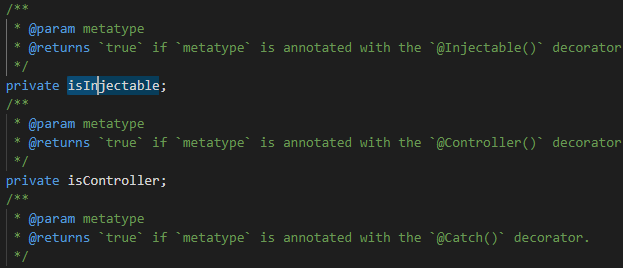

> ### This article is currently being translated

## 대상 독자
> - SpringBoot / NestJs 사용 경험이 있으신 분  
> - DI 에 대한 기본적인 지식이 있으신 분  
> - 프레임워크 내부 구현에 관심 있으신 분

## 0. Intro

제 인생 첫 DI 프레임워크는 군생활 중 우연히 사용하게 된 NestJs 였습니다. 당시 웹개발 생태계에 리액트로 첫 발을 내딛은 제게 동기가 Nest학습을 추천해주었고, 한국 소재 웹개발자라면 필연적으로 만나게 될 Spring과 상당히 유사하다는 말도 덧붙였습니다.
두 프레임워크를 모두 경험해보신 분들이라면 실제로 두 도구가 매우 비슷하게 추상화되어 있다는 사실을 금방 눈치채실 수 있었을 것 같습니다. 

제게는 Spring의 러닝 커브를 줄여 준 참 고마운 친구지만, 시간이 흘러 스프링 사용에 익숙해졌을 때 즈음 한 가지 의문이 들었습니다.

### 스프링의 콜드 스타트는 왜 이렇게 느릴까?

분명 두 프레임워크 모두 DI를 쉽게 할 수 있도록 도와주는 기능을 맡고 있고, 세부적인 철학은 조금 다를 수 있을테지만 적어도 사용자의 입장에서는 굉장히 유사하게 작동하는 것처럼 느껴지는 두 프로그램이 실행 시간에 있어서는 너무 큰 차이가 존재했습니다. 정확한 벤치마크를 찾진 못했지만 체감상 스프링에서는 빌드 시간이 10초에서 수십초 내지의 시간이 소요되는 데 반해 Nest는 길어야 5초 정도의 시간이 걸리는 것처럼 느껴집니다. 어째서일까요? 생각나는 요소는 꽤나 많지만 정확히 대답해보라고 묻는다면 다소 어렵게 느껴집니다.

...

하여 이러한 개인적인 호기심으로 출발하여 시작하게 된 서칭 과정에서 정리하게 된 지식들을 짧게나마 공유해보고자 합니다


## 1. 언어적 한계

너무 당연한 부분이라 적어야 할까 고민했지만, 그래도 어떻게 보면 가장 큰 요소라고 생각되어 최대한 간단하게 정리해보고자 합니다.

### 1) Spring의 경우


우선 JVM 계열 언어를 실행하기 위해선 소스를 바이트코드로 변환하는 과정이 필연적으로 요구됩니다. 왜 바이트코드 변환이
필요할까요? 당연히 JVM에 올려야 실행할 수 있기 때문입니다. 그리고 JVM은 메모리 점유율이 상대적으로 높은 편입니다.
이러한 JVM은 초기 구동시 클래스로딩, 가베지컬렉터 실행 등의 과정이 수반되기에 오버헤드가 굉장히 커질 수밖에 없습니다.

### 2) NestJS의 경우

NestJS는 당연히 node위에서 실행되기에 JVM보다 훨씬 가벼운 V8위에서 구동됩니다. 이 외에 그나마 복잡한 작업이라고 한다면 TS를 JS로 트랜스파일하는 것 말고는 추가적으로 복잡한 빌드 프로세스를 갖고 있진 않습니다.

---
\
그렇다면 이러한 차이가 실행 시간 차이의 주된 원인일까요? 만약 그랬다면 JVM vs V8 이 이 포스트의 제목이 됐어야 했을 것입니다. 실제로는 더 많은 차이가 있는데요, 지금부터 적게 될 두번 째 원인이 꽤나 큰 지분을 차지하고 있습니다.


<br/>

## 2. Reflection 범위의 차이

스프링 작동 원리에 한 번이라도 관심을 가져보셨거나, 다른 언어/프레임워크에서 런타임 도중 특정 객체의 정보를 파악하려는 시도를 해보셨다면 Reflection 이라는 개념이 친숙하게 느껴지실 겁니다. 먼저 이러한 Reflection이 실제로 어떻게 사용되고 있는지 짧게 내부 구현을 확인해보고자 합니다.

### Spring의 경우


spring boot 프로젝트를 생성한 후에 맨 처음 만나게 되는 ```@SpringBootApplication``` 어노테이션의 내부를 한 번 살펴봅시다.<br/>

 ```@Controller```, ```@Service``` 같은 어노테이션을 클래스 상단에 붙여놨다고 해서 [로드 존슨](https://en.wikipedia.org/wiki/Rod_Johnson_(programmer))이 알아서 취합해서 컨테이너에 등록해주는 게 아니다 보니 의존성 주입이라는 스프링의 핵심 기능을 사용하기 위해선 결국 주입 할 객체를 미리 담아두는 컴포넌트 스캐닝이 요구됩니다. 쉽게 말해 어떤 클래스에 특정 어노테이션이 붙어 있는 경우 main 메서드 구동 단계에서 이를 전부 스캔해두는 걸 의미합니다.<br/>

 ```@Bean``` 을 사용하면 컴파일 타임에 빈을 등록하는 게 가능하겠지만 보통은 개발 편의를 위해 런타임 타임에 주입될 빈을 결정하게 됩니다. 이제 ```@ComponentScan``` 어노테이션 내부 구현을 확인해봅시다.


프로젝트 창에서 볼 수 있는 코드는 인터페이스에 불과하기에 실제 스프링 코어 코드를 확인해야 실질적으로 Refelction이 사용되는 부분을 볼 수 있습니다. [이 링크](https://github.com/spring-projects/spring-framework/blob/main/spring-core/src/main/java/org/springframework/core/type/StandardAnnotationMetadata.java#L166) 에서 확인 가능합니다. 지면상 하나의 메서드만 첨부해봤는데, 위 같은 메서드는 내부적으로 리플렉션을 사용해 클래스에 어노테이션 정보를 수집하고, ```SearchStrategy.INHERITED_ANNOTATIONS``` 옵션을 사용해 상속된 어노테이션까지 탐색하고 있습니다. 

모든 경우를 살펴보진 못했지만 전반적으로 스프링 DI의 핵심 구현은 Reflection 위에서 이루어지고 있습니다. 단순하게 생각해봐도 Reflection은 런타임 중에 클래스 정보를 메모리에 전부 적재해야 하기 때문에 매우 매우 무거운 기능입니다. base package로 범위를 제한하는 방법도 있겠지만 reflection의 사용 범위를 획기적으로 줄이긴 쉽지 않을 겁니다. 그렇다면 NestJS는 어떻게 동작할까요? 

## NestJS의 경우


우선 NestJS의 간단한 컨트롤러 구현을 가지고 왔습니다. 
```@Controller()``` 어노테이션은 당연하게도 스프링의 그것과 대응되며 findAll 메서드위에 붙어있는 ```@Get()``` 어노테이션은 스프링의 ```@GetMapping``` 에 대응됩니다. 실제로 코드를 보면 스프링과 구조과 매우 흡사한데요, 사실 위 설명 중 하나 오류가 존재합니다.

Nest의 ```@Controller()``` 이러한 형식은 사실 어노테이션이 아닌 데코레이터가 맞습니다. 두 기능은 단순히 다른 서비스라는 이유로 같은 기능에 다른 네이밍을 한 게 아닌 꽤나 큰 차이가 존재합니다.

이번에도 역시 코어 코드를 통해 확인해보겠습니다.


(```node_modules/@nestjs/core/scanner.ts``` 에서 실제 코드를 확인 가능합니다)

당연히 위 한 줄의 코드만 보고 실제 기능을 파악하긴 힘든데요, 짧게 설명하자면 리플렉션을 사용해 특정 메타데이터만 선택적으로 긁어오는 메서드입니다.



조금 더 자세히 보자면 코드 내에 ```@Injectable()```, ```@Controller()``` 등 ***특정 데코레이터*** 의 메타 데이터만 수집하려는 세팅이 돼있습니다.

앞서 스프링을 봤을 땐

1. 전체 클래스를 스캔한 후에
2. 특정 어노테이션을 사용 중인 경우 컨테이너에 등록한다

의 순서를 따랐죠. 어찌 보면 당연한 수순입니다. 베이스 패키지 아래의 모든 클래스를 브루트포싱하지 않고 어떻게 모든 타겟 클래스를 탐색했다고 말할 수 있을까요? TypeScript가 마법이라도 부리고 있는 걸까요?

이 부분에서 어노테이션과 데코레이터의 차이가 두드러집니다.

### 데코레이터는 모듈 종속적이다

DI구현을 위한 스프링의 주된 방법이 reflection이라면 NestJs는 모듈을 기반으로 의존성을 구성합니다. NestJS는 데코레이터와 모듈 시스템의 조합으로 타겟 클래스를 정확히 찾아낼 수 있습니다. 

```ts
@Module({
  controllers: [CatsController],
  providers: [CatsService]
})
export class CatsModule {}
```

미리 모듈 파일에 컴포넌트를 직접 등록해두고, 여러 모듈들은 처음 어플리케이션이 bootstrap 될 때 루트 모듈인 app module에 로드됩니다. 이 과정에서 데코레이터가 실행되며, 메타데이터 등록도 자동으로 이루어집니다.
즉, 데코레이터는 모듈에 등록된 클래스에 한해서 동작하기에 모듈에 종속적인 기능입니다.

이처럼 모듈단위로 메타데이터를 관리하게 된다면 스프링처럼 처음부터 끝까지 reflection을 사용해 탐색하지 않고 미리 등록된 데이터를 빠르게 범위를 좁혀 가져올 수 있습니다.<br/>

<br/>

## 3. AOP 방식의 차이

스프링의 코어 기능 중 하나인 AOP에 대해서도 짚고 넘어갈 부분이 있습니다. 글이 너무 길어져 개념적인 설명은 생략하고 바로 비교로 넘어가보겠습니다.

```java
@Transactional
public void someMethod() {
   // ... 
}
```
스프링 AOP 기능을 설명할 때 가장 대표적인 예시로 등장하는 ```@Transactional``` 입니다. 복잡한 트랜잭션 보장을 구현하는 과정을 어노테이션 하나로 떼울 수 있는 고마운 기능입니다. 하지만 당연히 어노테이션이 붙은 메서드를 Spring AOP가 낚아채기 위해선 일련의 작업이 요구됩니다. 이 과정에서 [동적프록시](https://huisam.tistory.com/entry/springAOP)객체를 생성하게 되고, 프록시 객체 내부에서 역시나 리플렉션이 사용됩니다. 당연히 오버헤드가 큰 작업입니다.

```ts
@Injectable()
export class LoggingInterceptor implements NestInterceptor {
  intercept(context: ExecutionContext, next: CallHandler): Observable<any> {
    // ...
    return next.handle(); // 체이닝 (라이프사이클의 다음 인터셉터 실행행)
  }
}
```

반면 NestJS는 이러한 전통적인 AOP 방식 대신 함수 체이닝을 사용한 ```Interceptor```를 사용해 관심사 분리를 구현합니다. 역시나 리플렉션 사용 없이 명시적으로 인터셉터를 등록하는 방법을 사용해 오버헤드를 크게 감소시킵니다.
```ts
@UseInterceptors(LoggingInterceptor)
export class UserController {
  @Get()
  findAll() {
    return "someone..";
  }
}
```
이처럼 명시적인 interceptor 지정을 통해 동적 프록시 생성, 리플렉션 호출 오버헤드를 제거해 AOP 구현 과정에서도 NestJS가 속도상 더 이점을 갖게 됩니다.
<br/>
<br/>

## 4. 마치며

결국 쓰고보니 NestJS가 스프링보다 무지 빠른 훨씬 우월한 도구인 것처럼 묘사해버린 것 같은데요, 서론에 적었 듯 이 글은 단순히 '스프링 콜드스타트가 느린 이유'에 대한 호기심 해결을 목적으로 한 글입니다.

모든 소프트웨어가 그러하듯이 대부분의 성능 차이는 설계 목표에 따른 트레이드 오프로 발생합니다. 스프링은 엔터프라이즈급 서비스 구현에 적합한 도구이기에, 광범위한 유연성을 제공하기 위해 앞서 언급한 ```@ComponentScan``` 을 사용하여 개발자가 직접 컨텍스트를 구성하지 않아도 되도록 만듭니다. 또한, 어디까지나 콜드스타트가 느린 것 뿐이지 런타임이 길어질수록 내부적인 최적화가 이루어져 대규모 서비스 운영에 있어 꽤나 안정적인 선택지로 선택될 수 있을 겁니다.

반면 Nest는 JS/TS 생태계를 활용하여 더 빠른 개발사이클 지원과 경량 실행 환경을 만드는 데 중점을 두었기에 콜드 스타트가 빠르고, 덕분에 콜드 스타트가 빈번한 서버리스 환경에서 매력적인 선택지로 보일 것 같습니다. 제 좁은 식견으로 볼 때 이러한 이점이 개발 사이클을 짧게 가져가야 하는 스타트업에서 node를 종종 선택하는 이유가 되지 않았을까 싶습니다.

## 참고자료
- [https://docs.nestjs.com/modules](https://docs.nestjs.com/modules)

- [spring core](https://github.com/spring-projects/spring-framework/blob/main/spring-core/src/main/java/org/springframework/core/type/StandardAnnotationMetadata.java#L166)

- [https://docs.nestjs.com/interceptors](https://docs.nestjs.com/interceptors)

- [https://huisam.tistory.com/entry/springAOP](https://huisam.tistory.com/entry/springAOP)